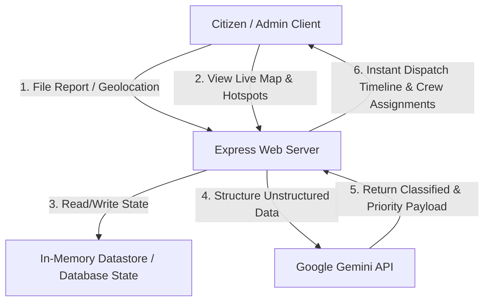
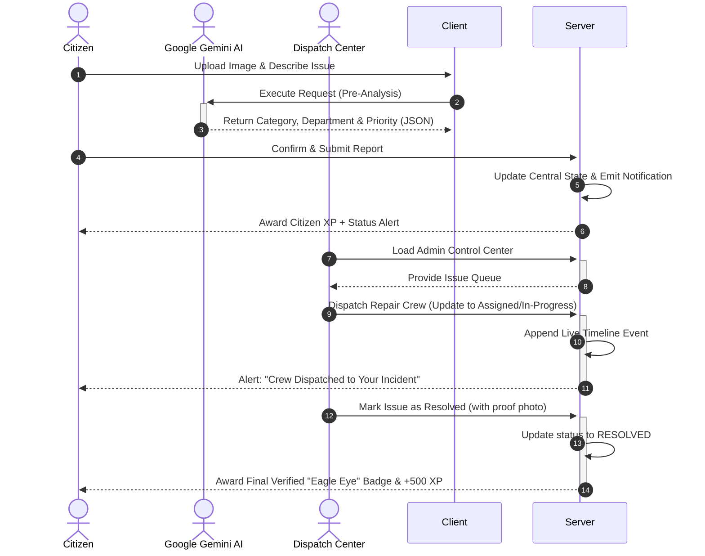
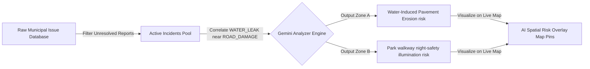

# CivicPulse AI: Next-Generation Smart City Municipal Incident Hub

> **Project System & Documentation Guide**  
> *Empowering citizens, accelerating municipal dispatch, and optimizing public infrastructure with predictive AI.*

---

## 1. Problem Statement Selected

### The Challenge of Fragmented Urban Maintenance
In modern metropolitan areas, public infrastructure is the lifeblood of safety and economic flow. However, municipal maintenance departments and citizens struggle with highly fragmented, legacy communication channels:
1. **Inefficient Reporting Channels:** Citizens must navigate confusing phone trees, archaic web forms, or non-responsive emails to report simple issues like pothole damages or broken utilities.
2. **Lack of Live Visibility:** Once a ticket is filed, it enters a "black box" system. Citizens receive no updates on dispatch times, crew assignments, or resolution status.
3. **Overwhelmed Dispatch Teams:** Municipal workers are forced to manually sort, classify, rank, and route thousands of unstructured reports daily, delaying critical emergency repairs.
4. **Cascading Infrastructure Failures:** Minor issues left unresolved escalate into catastrophic damage:
   - **Case A (Utility Hazard):** A *burst water pipe* causes immediate sidewalk flooding, which can wash out the underlying sub-grade soil, leading to sudden asphalt collapse and sinkholes.
   - **Case B (Security Hazard):** A *broken streetlight on a dark park walkway* near public swings leaves families, children, and late-night pedestrians vulnerable to high safety and security risks.

---

## 2. Solution Overview

### CivicPulse AI - The Intelligent Smart Hub Bridge
**CivicPulse AI** is a fully integrated, full-stack, real-time municipal hub designed to bridge the gap between active citizen observation and intelligent municipal dispatch. 

By leveraging the cutting-edge capabilities of **Google Gemini API**, the platform automates the critical path of incident handling:
- **Instant Citizen Filing:** Citizens upload geotagged photos or describe issues in plain text.
- **Dynamic Gemini-Powered Pre-Analysis:** Before submission, Gemini instantly parses the description and image to auto-classify the category, calculate a multi-factor **Severity and Priority Score (1-100)**, and route it to the optimal division (e.g., Water and Power Board, Department of Public Safety).
- **Interactive Live Map & Overlays:** Issues are mapped geolocatively. An **AI Spatial Risk Overlay** allows dispatchers to toggle predictive hotspot assessments, grouping correlated incidents to isolate root causes.
- **Robust Admin Control Center:** Admins can inspect active alerts, assign municipal crews, manage timelines, and update states.
- **Gamified Engagement:** Citizens earn Level Achievements, XP points, and customizable merit badges (e.g., *Eagle Eye*, *First Responder*) for reporting verified hazards, ensuring high user retention and public trust.

---

## 3. Key Features

* **AI-Guided Smart Filing Form:** Supports drag-and-drop or local file image uploads. Instantly executes Gemini pre-analysis to preview predicted departments, priority ratings, and categories before submission.
* **Interactive Live Geolocation Map:** Uses custom-styled map pins indicating status (Resolved, In-Progress, Verified, Assigned) with immersive detail modals. Includes a toggleable **AI Predictive Hotspot Overlay** representing simulated density matrices.
* **Intelligent Admin Command Panel:** Dispatch center equipped with custom keyword search filters, quick-action dispatchers (e.g., assigning dedicated response squads), and administrative timeline override tools.
* **Interactive Timeline Resolution Tracker:** Live timeline visualizations tracing the lifecycle of each issue from *Reported* $\rightarrow$ *Verified* $\rightarrow$ *Assigned* $\rightarrow$ *In-Progress* $\rightarrow$ *Resolved*.
* **Citizen Activity Hub & Gamified Profile:** Tracks user stats, level progress, and active XP point counters. Custom showcase for earned digital badges.
* **Dynamic Notification Center:** Live notification drawer displaying immediate alerts regarding status changes, crew assignments, verification comment highlights, or potential duplication flags.

---

## 4. Technologies Used

### Frontend Architecture
* **React 18 + Vite:** Modern, high-performance, single-page client framework compiling assets in real-time.
* **TypeScript:** End-to-end type safety, declaring strict `Issue`, `Comment`, `Notification`, and `Analytics` structures.
* **Tailwind CSS:** Responsive utility framework styled with high-contrast slate-900 backdrops, clean off-white elements, and precise cobalt blue (`#2563eb`) accents.
* **Motion (Framer Motion):** Smooth micro-animations, staggered card entrances, tab transition fades, and bouncing icon alerts.
* **Recharts:** Responsive custom visualizations including Area Charts for weekly trend forecasting and Bar Charts for department workload metrics.
* **Lucide Icons:** Unified vector icon library.

### Backend & Middleware
* **Express & Node.js:** Robust full-stack REST server configured to serve the single-page application and expose secure API routes.
* **tsx Execution:** Live native TypeScript compilation for development mode.
* **esbuild Bundler:** Production packaging that bundles server files into a high-performance, self-contained CommonJS target (`dist/server.cjs`).

---

## 5. Google Technologies Utilized

* **Google Gemini API (`@google/genai` SDK):** 
  - **Dynamic Input Analysis:** Processes unstructured citizen reports and image mock metadata, parsing them into structured JSON payloads containing classifications, department suggestions, and priority ratings.
  - **Predictive Risk Modeling:** Examines active incident logs and correlates spatial distributions to predict systemic failure zones (such as predicting structural sub-base collapse under saturated pavement).
* **Cloud Run Containers:** Serves the backend and hosting environment inside isolated, auto-scaling, low-latency container environments.

---

## 6. Architecture & System Workflows

### System Architecture Diagram

---

### Incident Lifecycle Workflow (Sequence Diagram)

---

### AI Spatial predictive Hotspot Workflows

---

## 7. Problem Statements & Solutions in Code

### Scenario A: Burst Water Pipe causing Sidewalk Flooding
* **Problem:** High-pressure water leaking beneath pavement slabs is gushing, destabilizing concrete plates, and threatening local road foundations with sinkholes.
* **System Resolution:**
  - Classified as `WATER_LEAK`.
  - Dispatched automatically to the **Water and Power Board**.
  - Associated with a high-priority rating ($85/100$) due to potential cascading underground erosion.
  - Initial photo assets attached (`https://images.unsplash.com/photo-1542013936693-8848e574047e`) showcasing localized flooding.

### Scenario B: Broken Streetlight on Park Walkway
* **Problem:** Overlooking children's playgrounds, completely dark, posing pedestrian security risks in late-evening hours.
* **System Resolution:**
  - Classified as `STREETLIGHT`.
  - Dispatched automatically to the **Department of Public Safety**.
  - Flagged on the live map within central parks with dark walkway previews (`https://images.unsplash.com/photo-1519125323398-675f0ddb6308`).
  - Active timeline track monitors replacement bulb inventory and crew schedules.
